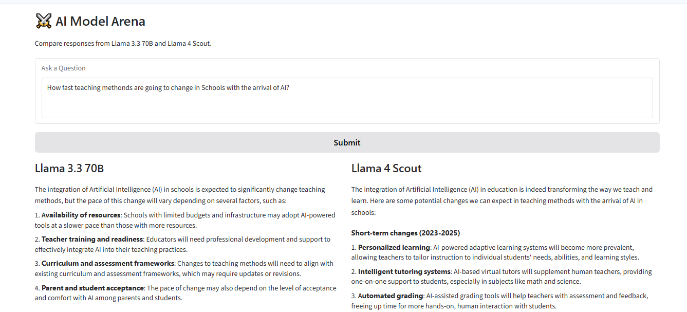

# AI Model Arena

A simple AI model comparison application built using **Groq API** and **Gradio**.

## Screenshot



This application allows users to enter a question and compare responses from two different Large Language Models (LLMs) side-by-side:

* **Llama 3.3 70B Versatile**
* **Llama 4 Scout 17B**

---

## Features

* Compare responses from two AI models simultaneously
* Interactive web interface using Gradio
* Fast inference powered by Groq
* Clean side-by-side response layout
* Easy to extend with additional models

---

## Technologies Used

* Python
* Groq API
* Gradio
* python-dotenv

---

## Project Structure

```text
Arena_Model/
│
├── app.py
├── arena.py
├── requirements.txt
├── README.md
├── .gitignore
└── .env (ignored)
```

---

## Installation

### 1. Clone the Repository

```bash
git clone https://github.com/MCPraveen1/ai-model-arena.git
cd ai-model-arena
```

### 2. Create Virtual Environment

```bash
python -m venv .venv
```

### 3. Activate Virtual Environment

**Windows**

```bash
.venv\Scripts\activate
```

**Mac/Linux**

```bash
source .venv/bin/activate
```

### 4. Install Dependencies

```bash
pip install -r requirements.txt
```

---

## Environment Variables

Create a `.env` file in the project root:

```env
GROQ_API_KEY=your_groq_api_key_here
```

---

## Run the Application

```bash
python app.py
```

Open your browser and visit:

```text
http://127.0.0.1:7860
```

---

## Example Question

```text
How fast will teaching methods change with the arrival of AI?
```

The application will generate responses from both models and display them side-by-side for comparison.

---

## Sample Output

* Llama 3.3 70B response
* Llama 4 Scout response
* Side-by-side comparison interface

---

## Learning Outcomes

Through this project, I learned:

* Working with multiple LLMs
* Integrating Groq APIs
* Building AI-powered web applications
* Creating interactive interfaces using Gradio
* Structuring projects for GitHub deployment

---

## Author

**Praveen MC**

Transitioning from 25+ years in Medical Transcription to AI, Machine Learning, and Data Science through continuous learning and hands-on projects.

GitHub: https://github.com/MCPraveen1

---

## License

This project is for learning and educational purposes.
